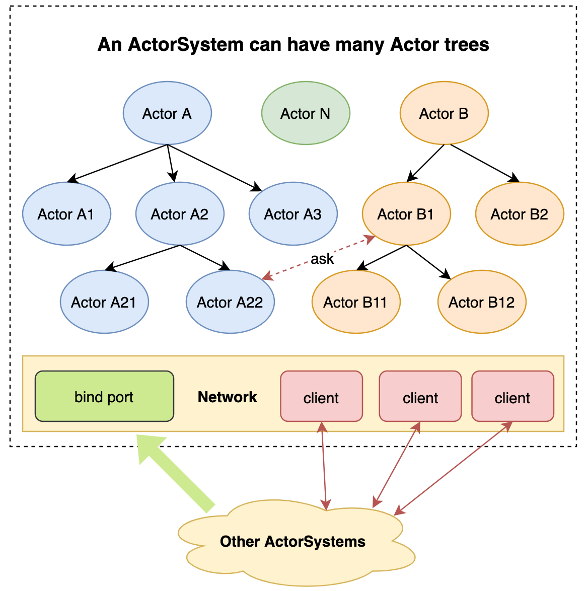

#### 目的
为了充分理解以Actor为基础的响应式框架实现，以[zio-actors](https://github.com/zio/zio-actors)项目为蓝本，实现自己的actor库。

#### 设计实现
核心思想概括为以下三点：
- 队列消除同步等待
- 独立线程执行对消息的处理，ZIO中使用Fiber
- 对状态的改变，封装在Actor内部；外部无法直接访问

以上一个Actor的内部结构，Actor运行在ActorSystem环境中，而ActorSystem可以存在很多个（一个进程、多个进程都可以）。

#### 对比Spark中Actor实现
[spark-rpc](https://github.com/changzhiwin/spark-rpc)这个是Spark内部对Actor原理的实现。

|  对比项    | zio-actor   | spark-rpc            |  
| --------- | ----------- |  ------              |
| 网络层     | zio-nio     | netty                |
| 队列       | ZIO#Queue   | java.util.LinkedList |
| 执行器     | ZIO#Fiber   | 线程池                |
| 异步       | ZIO#Promise | Future               |

